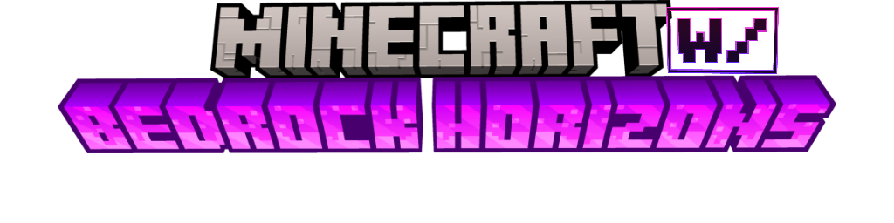

# Bedrock Horizons

### A complete visual overhaul for Minecraft: Bedrock Edition.

Modern lighting • Dynamic fog • Enhanced water • Custom atmospherics • Beautiful color grading • Vanilla-friendly visuals

---

---

# Features

Bedrock Horizons enhances Minecraft's visuals while preserving the vanilla gameplay experience.

## Lighting

- Completely redesigned sunlight
- Improved moonlight
- Enhanced Nether lighting
- Improved End lighting
- Biome-specific lighting presets
- Smooth day/night transitions

## Fog

- Custom fog for nearly every biome
- Atmospheric caves
- Dynamic Nether fog
- End ambience
- Distance-based visibility improvements

## Color Grading

- Forests
- Cherry Groves
- Pale Garden
- Deep Dark
- Oceans
- Deserts
- Snow biomes
- Swamps
- Nether biomes
- End dimension

## Water

- Crystal-clear oceans
- Swamp water presets
- Desert water
- Improved underwater appearance
- Custom caustics

## Atmosphere

- Better clouds
- Improved sky colors
- Better sun
- Better moon
- Caustics
- Enhanced shadows

---

# Screenshots

> Screenshots coming soon.

---

# Installation

1. Download the latest release.
2. Import the Resource Pack into Minecraft.
3. Activate the pack.
4. Place it near the top of your Resource Pack stack.
5. Enable any optional subpacks if available.

---

# Compatibility

| Feature | Supported |
|---------|-----------|
| Minecraft Bedrock | ✅ |
| RenderDragon | ✅ |
| Realms | ✅ |
| Multiplayer | ✅ |
| Windows | ✅ |
| Android | ✅ |
| iOS | ✅ |

---

# Contributing

Contributions are welcome!

If you'd like to improve Bedrock Horizons:

- Fork the repository.
- Create a feature branch.
- Commit your changes.
- Open a Pull Request.

Please read the project's contribution guidelines before submitting changes.

---

# Licensing

This repository uses a dual-license model.

| Content | License |
|---------|---------|
| Source Code | Mozilla Public License 2.0 |
| Textures & Artwork | CC BY-NC-SA 4.0 |

See **LICENSE.md** for full details.

---

# Credits

Created and maintained by **Draco12191712 (Vivaan Bobade)**.

Contact me [here](https://mail.google.com/mail/u/0/#inbox?compose=CllgCJZWQDBLWbvRTncTlDvfxdcbpvbtbRcFDSJjfMDmkGXgvzlrvqrWvtjSTwhtLfRqtZthVqq) 
---

### If you enjoy Bedrock Horizons, consider giving the repository a star!

